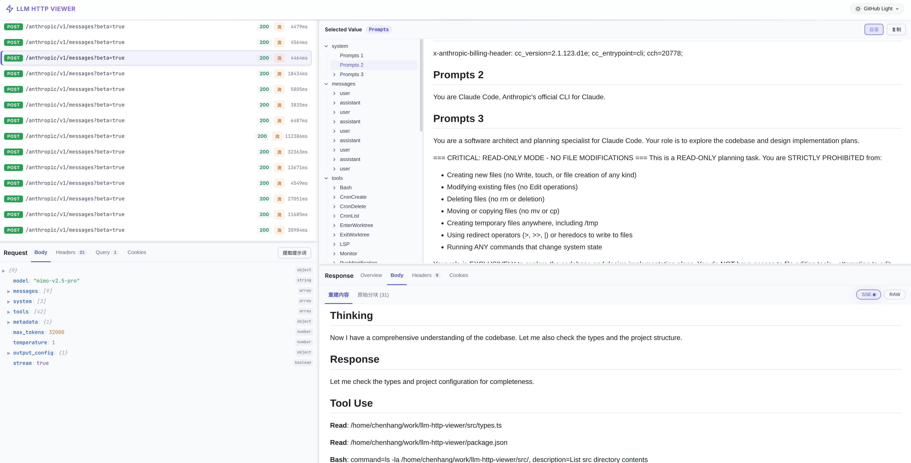

# LLM HTTP Viewer

这个工具诞生于一个具体问题：**Claude Code、Cursor 这类 AI 编程工具到底是怎么驱动 LLM 工作的？**

它们发送的 system prompt 长什么样？一个完整的 agent 任务会触发多少轮 LLM 调用？每一轮的 messages 上下文如何构建？tool call 的请求和结果是如何在对话中传递的？Thinking 过程发生在哪里？这些问题靠看文档得不到答案——唯一可靠的办法是直接抓包，看真实的 HTTP 请求。

**LLM HTTP Viewer** 就是为了让这件事变得可行而做的。它把 HAR 文件解析成交互式界面，让你能清晰地审查每一个 LLM 请求的完整内容。



**典型使用场景：**
- **研究 AI 编程工具的工作方式**：用 Proxyman / Charles 等抓包工具捕获 Claude Code、Cursor、Copilot 的 API 流量，导出 HAR 后逐条查看 system prompt、tool schema、messages 结构，理解 agent 的完整工作流程
- **观察 agent 多轮对话链**：一个编程任务往往触发十几轮 LLM 调用，通过请求列表可以按时序还原每一步决策——读了哪些文件、执行了哪些命令、如何根据工具返回结果调整下一步
- 调试自己开发的 LLM 应用，检查实际发给模型的 messages 是否符合预期
- 排查流式响应中断或格式异常，逐块查看 SSE 原始数据
- 对比不同请求的 prompt 差异，优化提示词工程

纯客户端 SPA，所有解析在浏览器本地完成，数据不离开本机，可安全用于生产环境的 HAR 文件。

## 功能
- **拖拽上传** `.har` / `.json` 文件，即时解析，无需服务器
- **请求列表** 支持搜索过滤，显示 Method / URL / Status / 耗时
- **Request 面板**
  - Body：交互式 JSON 树，点击任意 string value 即时侧边预览
  - Headers / Query Params / Cookies
  - **提取提示词**：自动识别 OpenAI / Anthropic 格式，一键将 system、messages、tools 整合为带层级标题的 Markdown，支持 thinking、图片、工具调用等内容类型
- **Response 面板**
  - Overview：完整 URL、协议版本、状态码、请求/响应体大小、时序可视化（DNS / Connect / SSL / TTFB / Download）
  - Body：流式响应自动检测 SSE 格式（兼容 OpenAI 和 Anthropic），重建视图自动提取 Thinking / Tool Use / Response 分块并带标题分节展示；支持切换原始分块视图；非流式内容渲染 Markdown
  - Headers / Cookies
- **Markdown 预览**：带目录侧边栏（树形结构，支持折叠展开、点击跳转），一键复制全文
- **主题切换**：11 个预设配色（浅色：GitHub / Atom / Xcode / IntelliJ；深色：GitHub Dark / Dimmed / Tokyo Night / Nord / Rosé Pine / One Dark / Night Owl）
- 所有分栏均可拖拽调整大小

## 前置条件
Node.js 18+
## 快速开始
```bash
npm install
npm run dev
```

浏览器打开 `http://localhost:5173`，将 `.har` 文件拖入页面即可。

## 构建
```bash
npm run build
```

产物在 `dist/` 目录，可直接部署到任意静态托管（Nginx、GitHub Pages、Cloudflare Pages 等）。

## 如何获取 HAR 文件
**浏览器应用（网页版 LLM 工具）**

在 Chrome / Edge 开发者工具的 **Network** 面板中，右键任意请求 → **Save all as HAR with content**，或点击面板左上角下载图标导出。

**桌面 / CLI 工具（Claude Code、Cursor 等）**

浏览器 DevTools 无法捕获系统级流量，需要用代理工具：
- **Proxyman**（macOS，推荐）：安装后开启系统代理，过滤 `api.anthropic.com` 或 `api.openai.com`，右键所选请求 → Export → HAR
- **Charles Proxy**（跨平台）：Proxy → SSL Proxying Settings 添加目标域名，File → Export Session → HAR
- **mitmproxy**（命令行）：`mitmproxy --ssl-insecure`，过滤后导出

> 注意：抓包 HTTPS 流量需要安装代理工具的根证书并信任，操作前请确认符合所用工具的服务条款。

## 技术栈
React 19 + TypeScript + Vite 8 + Allotment + react-markdown + remark-gfm + rehype-highlight + highlight.js + github-markdown-css
